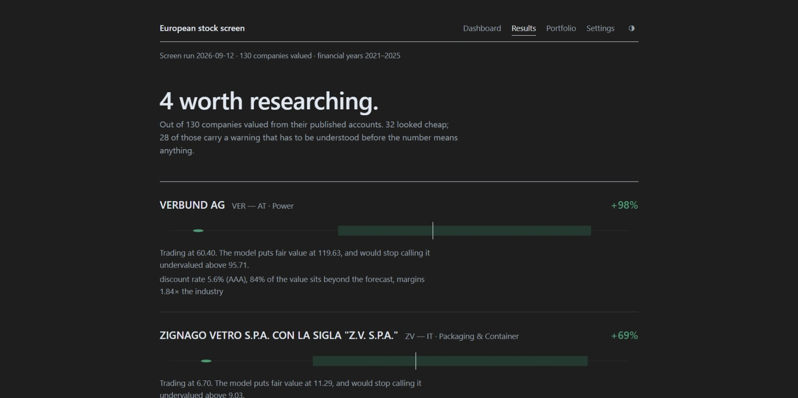
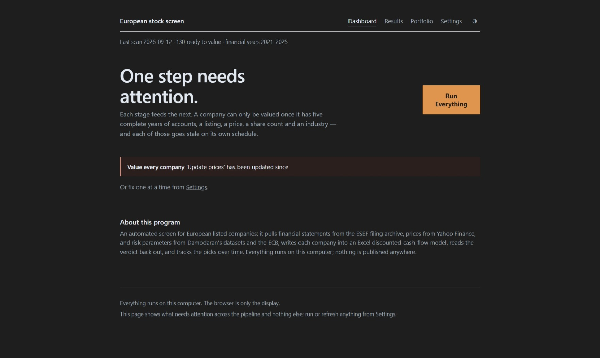
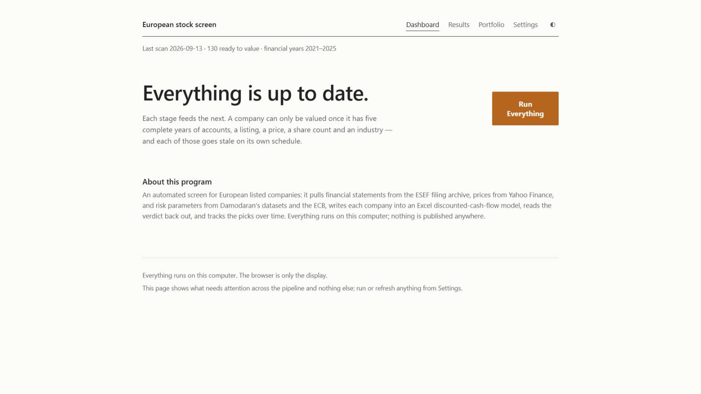
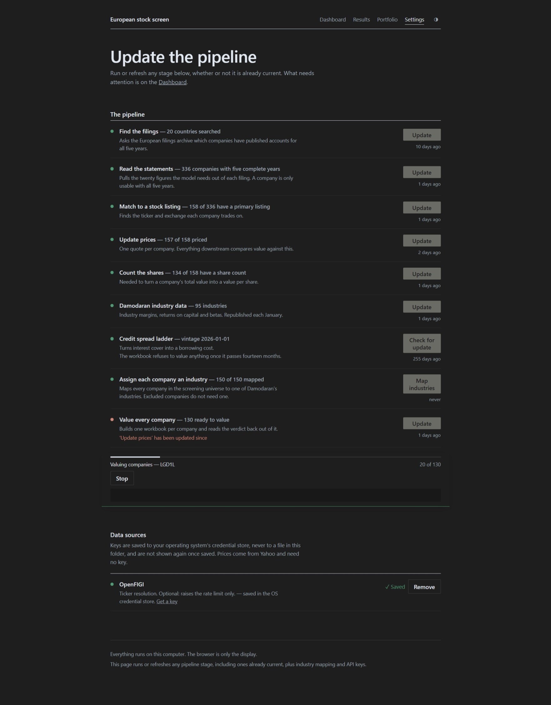
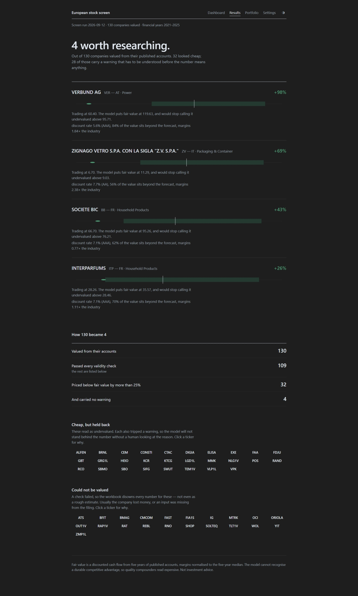
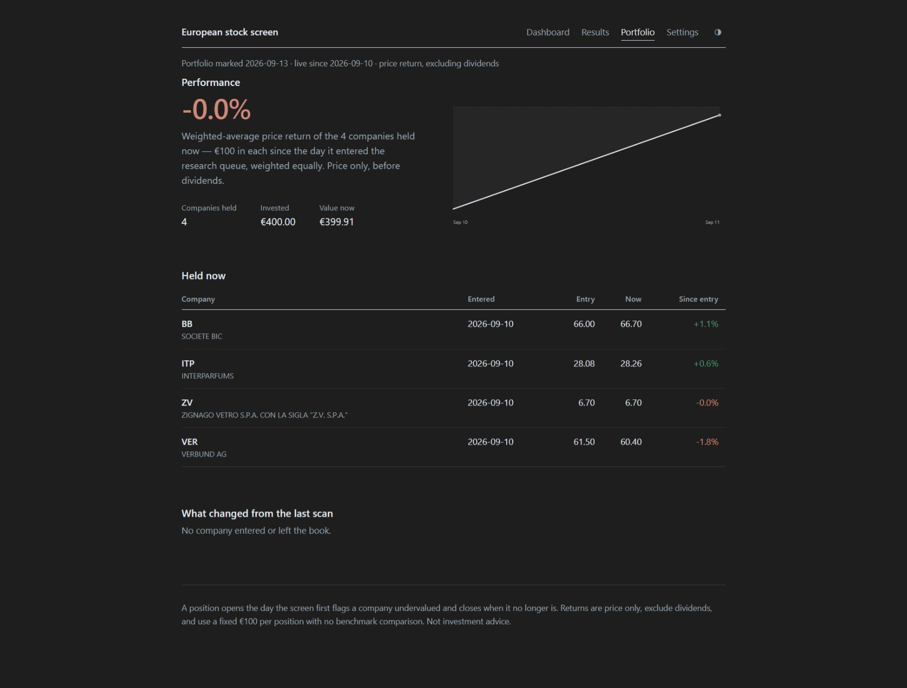
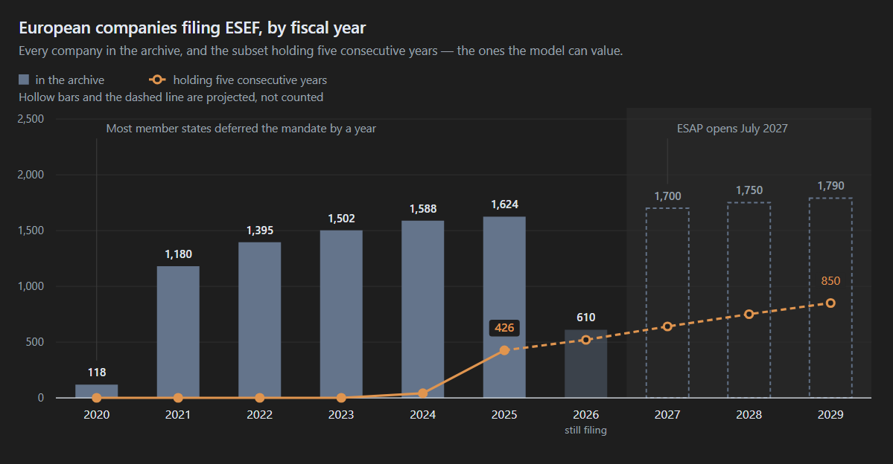

# European Equity Valuation Engine & Portfolio Tracker


[](https://riccardoperana.github.io/European-Stock-Screener/)

**An automated DCF screener for European listed companies — runs entirely on your machine.**

**[→ Click Here for the Live Preview](https://riccardoperana.github.io/European-Stock-Screener/)** —
This page is rebuilt quarterly by GitHub Actions from this repo's own pipeline,
with the portfolio re-marked to market every weekday in between,
and contains the Results page, the Portfolio Tracker, and a "Methodology" page,
previewing the valuation model itself.  
Run the tool yourself (see "Getting started" below) for the full, private
version — real € prices and figures included.
<picture>
  <source media="(prefers-color-scheme: dark)" srcset="screenshots/presentation.png">
  <source media="(prefers-color-scheme: light)" srcset="screenshots/presentation.png">
  
</picture>

<sub>The output of a screening run — whatever the model found, not a curated list.</sub>

It pulls financial statements from the ESEF (XBRL) filing archive, prices from
Yahoo Finance, and risk parameters from Damodaran's datasets and the ECB; writes
each company into an Excel valuation model; reads the verdict back out; and tracks
the resulting picks over time.

Everything runs locally through a minimalist web dashboard, and nothing
you run yourself is published or transmitted to any third party. A
separate, price-redacted version of the results (see above) is rebuilt
and published by this repo's own GitHub Actions workflows —
that is the only thing that ever leaves the pipeline; see
[Live preview on GitHub](#live-preview-on-github) and
`core/build_report.py`'s `public` mode.

**Disclaimer:** This project does not constitute financial advice. 
It is a research tool intended to support independent analysis, 
not a recommendation to buy or sell any security. Screening is conducted
purely for research purposes; there is no expectation that the companies 
it flags will outperform the broader market. Reported returns reflect price
performance only and exclude dividends. The portfolio tracker and the
validation tooling described below (see "Correctness and validation")
exist to confirm that the model computes what it claims to compute — not
to represent, imply, or track investment performance.

---

## Why this exists
Individual valuation analysis is vulnerable to a small set of recurring
biases, most of which have nothing to do with the quality of the analysis
itself and everything to do with which companies get looked at in the first
place:
- **Familiarity bias** — analysis tends to concentrate on companies the
  analyst already recognizes, leaving the rest of the market unexamined by
  construction.
- **Anchoring on price history** — a company's recent share-price trend
  shapes the analyst's expectations before the underlying fundamentals are
  even considered.
- **Sentiment bias** — a prior positive or negative opinion of a company
  colors how its financial statements get read, independent of what those
  statements actually say.
- **Narrative bias toward innovative sectors** — attention gravitates
  toward technology and other high-growth sectors, leaving traditional and
  unglamorous industries under-covered even when they screen cheaply.
- **Home-market bias** — analysis defaults to companies from large, familiar
  economies, leaving smaller European markets largely unexamined.

This tool is designed to remove the analyst from each of these decisions.
Every company that clears the data-completeness bar is valued through the
same discounted-cash-flow model, using the same assumptions, regardless of
whether the analyst has heard of it, how its share price has moved, how the
analyst feels about it, which sector it is in, or which country it is
listed in. The valuation is mechanical and the universe is comprehensive;
the only thing that determines whether a company gets flagged is whether
its own published financial statements say it is priced below its
calculated fair value.

## Screenshots

### Dashboard


The landing page. Lists every pipeline stage, whether it is current, and
surfaces only the notifications that need attention (a stale credit-spread
ladder, a new reporting quarter, and so on). The single "Run Everything"
action re-runs every automatable stage in dependency order.

### Dashboard — fully up to date


The same page in its calm state (light theme): every stage current, no
outstanding notifications. Shown alongside the previous screenshot to
illustrate that the dashboard's notification panel reflects actual pipeline
state rather than a fixed set of prompts.

### Settings


Every pipeline stage with its own control, whether or not it is already
current, plus the two assisted workflows that need a person in the loop:
mapping a company to a Damodaran industry (via a copy-pasted LLM prompt)
and confirming an update to the Damodaran credit-spread ladder before it is
written.

### Results



The output of a screening run: the research queue of undervalued companies
ranked by upside, the funnel showing how the full universe narrowed down to
that queue, and the companies held back or void, each with the reason.
This is the page that demonstrates the bias-removal argument directly — the
queue is whatever the model found, not a curated list.

### Portfolio



The tracked outcome of following the model's picks over time: a
weighted-average return chart, individual position performance, and a
record of what changed at the most recent scan.

---

## Getting started

### For most people (Windows) — no Python, no terminal

You should already have the `StockScreen` folder (this is
`packaging/dist/` — see "Building the portable executable" below for how
it gets produced). Just double-click `StockScreen.exe` inside it. That
opens `http://127.0.0.1:8765/` in your browser — the same dashboard
described below. The folder is self-contained: copy it anywhere, and
nothing needs to be installed on the machine first.

The first run still needs the coverage/extract/identity/prices/shares
pipeline stages run once (from the Dashboard's "Run Everything" button) to
populate real data, same as a fresh checkout would.

### Running from source (for development)

- **Python 3.10+**
- A spreadsheet engine to recalculate the model — one of:
  - Microsoft Excel (Windows), via `pywin32`, or
  - LibreOffice, with `soffice` on `PATH` (any operating system)
- `pip install -r requirements.txt`

```
python gui/app.py
```

Opens `http://127.0.0.1:8765/` in your browser. The dashboard shows every
pipeline stage, whether it is current, and a button to run it. Closing the
browser window stops the server; press Ctrl+C to stop it from the
terminal.

While the app is running it refreshes the prices of the companies
currently held in the portfolio once per calendar day (Yahoo Finance, held
positions only — a handful, so it is quick). Disable with
`--no-daily-prices`.

Paths (`financials.db`, `parameters.json`, the template, `valuations/`,
`out/`) are resolved relative to the project, not the working directory, so
it can be started from anywhere.

### Building the portable executable

This is a developer step — end users never run it. To produce a fresh
`StockScreen.exe` to hand out (after a code or config change):

```
python packaging/build_dist.py
```

This produces `packaging/dist/StockScreen.exe` alongside the configuration
files it needs at startup. The resulting folder is self-contained — copy it
anywhere and run the executable directly; no Python installation is
required on the target machine. See `packaging/app.spec` for the build
configuration.

## Live preview on GitHub

Two workflows in `.github/workflows/` publish the price-redacted site to
GitHub Pages:

| Workflow | When | What |
|---|---|---|
| **General screening** (`screen.yml`) | 15th of Jan/Apr/Jul/Oct, or by hand | the full pipeline, then the site and the README screenshot |
| **Update prices** (`update-prices.yml`) | weekdays 17:30 UTC, or by hand | prices for the last screen's companies only; opens/closes portfolio positions against its fair values (`core/price_update.py`); republishes the portfolio page |

The screen also rolls the five-year fiscal window forward by itself: once
80% of the companies in the current window have filed the next year's
annual report, it moves to that year and records it in
`screen_config.json` (`ROLL_THRESHOLD` in `scripts/ci_screen.py`). An
explicit `"fiscal_years"` in that file pins the window instead.

Between runs the pipeline's state (`financials.db`, `portfolio.db`, the
parameter files, `screen_config.json`, the last `run_DATE.json` and the
built site) is kept as
one AES-256-encrypted archive on the `pipeline-state` release, written by
`scripts/ci_state.sh`. Encrypted because it contains Yahoo prices; a
release rather than a branch because a branch rejects files over 100 MB
and would keep a copy of the database for every day.

Setup: add the repository secrets `STATE_KEY` (any long random
passphrase — keep a copy, the state cannot be read without it) and,
optionally, `GEMINI_API_KEY` / `OPENFIGI_API_KEY`; set
**Settings → Pages → Source** to **GitHub Actions**; then run
**General screening** once by hand. To start from a desktop run instead
of from scratch, from a clone with the GitHub CLI logged in:

```bash
STATE_KEY='the passphrase' bash scripts/ci_state.sh persist "Seeded from desktop"
```

## The pipeline

Each stage feeds the next. A company can only be valued once it has five
complete fiscal years, a stock listing, a price, a share count and a
Damodaran industry.

| Stage | Script | What it does | Cadence |
|---|---|---|---|
| Coverage | `core/esef_coverage.py` | which EU companies filed five years of ESEF reports | annual |
| Extract | `core/esef_extract.py` | 20 financial line items × 5 years from each filing | annual |
| Identity | `core/resolve_identity.py` | LEI → ISIN → ticker; shares implied by EPS | annual |
| Prices | `core/fetch_prices.py` | one closing price per company (EUR only) | quarterly |
| Shares | `core/shares_worksheet.py` | diluted share count; hand-entered where derivation fails | annual |
| Parameters | `core/fetch_parameters.py` | risk-free rate (ECB), country risk and industry betas (Damodaran) | annual + quarterly rate |
| Industries | `core/industry_worksheet.py` | map each company to a Damodaran industry (LLM-assisted) | as needed |
| Screen | `core/run_screen.py` | write each company into the workbook, read the verdict | quarterly |
| Track | `core/track.py` | apply the run to the portfolio; mark to current prices | after each screen |

`core/screen.py` reports where the pipeline currently stands and what to
run next.

## Valuation and signal logic

**[→ Explore the model itself](https://riccardoperana.github.io/European-Stock-Screener/methodology.html)** —
the live "Methodology" page renders `valuation_template.xlsx` sheet by
sheet in your browser (filled with the project's own fictional demo
company, the same fixture the regression test checks against), plus a
link to download the workbook directly.

- **Fairly valued:** upside (fair value ÷ price − 1) between −25% and +25%.
- **Undervalued:** fair value more than 25% above the market price, i.e.
  market price < value ÷ 1.25 (about 20% below fair value). The research
  flag is that verdict with no warning attached.
- **Exit target:** market price ≥ value (the midpoint).
- The portfolio opens a notional €100 position the first time a company is
  flagged undervalued, and closes it when the verdict is no longer
  undervalued.

## Output

- `valuations/<date>/` — one workbook and one `*.provenance.json` per
  company, plus `run_<date>.json` and `report_<date>.html`.
- `out/` — the ESEF coverage scans (`esef_coverage_<timestamp>.csv/.json`)
  the extractor reads.

## Data sources and their terms

- **ESEF filings** — `filings.xbrl.org`, public.
- **Damodaran datasets** — NYU Stern, freely published for research.
- **ECB Data Portal** — public.
- **Yahoo Finance** — undocumented and **not licensed for programmatic
  access**. It is selected only via `--source yahoo`, never by default,
  and prices are never published or redistributed: the public pages show
  no price or fair-value figure (only percentages), and the GitHub Actions
  state that contains prices is stored encrypted.

## Correctness and validation

Do not change the DCF routines, the Excel cell formulas, or the five-year
fiscal window. The regression anchor is `DEMO.MI` `D83 = 11.4538271570406`.

```
python tests/golden_test.py --engine excel      # or --engine libreoffice
python -m pytest
```

`tests/golden_test.py` recalculates the shipped demo workbook and every
negative fixture, and confirms the result against the regression anchor
above — this proves the recalculation *engine* is correct: given known
inputs, the workbook returns the known output. `pytest` (configured by
`pytest.ini`) covers the cache, the extractor, the parameter parsers, the
share-count worksheet, the CLI entry points, the dashboard job runner, the
portfolio tracker and the report sections.

Engine correctness alone does not prove that a given company's *inputs*
were extracted correctly — twenty fields, five fiscal years, taxonomy
element matching, sign conventions and unit scaling all sit between a
filing and a number in the model. The extractor guards that path itself:
every value is stored with its provenance (reported, summed, computed,
assumed zero, sign-flipped), a company-year that contradicts itself (debt
without interest, or interest without debt) is blocked rather than valued,
and each run prints a per-field failure report.

## Engineering challenges

Building a fully automated pipeline on top of standardized regulatory
filings surfaced several problems that are not visible from the model
alone. The more significant ones, and how each was addressed:

- **Borrowings tagged nowhere on the balance sheet.** A number of filers
  report interest expense — implying real debt — without tagging the
  corresponding borrowings anywhere in the standard taxonomy. Treating the
  missing figure as zero understates invested capital, overstates return
  on capital, and understates the discount rate, biasing every affected
  valuation upward at once. The pipeline now derives a debt estimate from
  the non-current liability total when this pattern is detected, gated so
  it only applies where interest expense confirms real borrowings exist —
  a genuinely debt-free company is left alone.

- **No industry classification anywhere in the filing standard.** ESEF
  carries no sector or industry tag, and the valuation model requires one
  (Damodaran's industry-level margins, returns and betas). Financial
  companies — banks, insurers, REITs — must also be excluded, since a
  discounted-cash-flow model built for operating companies does not apply
  to them, and nothing in the filing says which companies these are. Two
  independent signals now do this: a name-based filter, and a
  balance-sheet shape heuristic checked against it; correct industry
  classification for non-financial companies is handled as an
  LLM-assisted, human-confirmed workflow, since no reliable automated
  source of that mapping exists.

- **No point-in-time diluted share count in the taxonomy.** The valuation
  needs a diluted share count as of the valuation date; IFRS filers tag a
  *weighted-average* diluted count (for EPS) and a *point-in-time basic*
  count, but never a point-in-time diluted one. The pipeline derives an
  estimate from the two and cross-checks it against the filing's own
  numbers, flagging any company where the derivation does not reconcile
  rather than reporting a silently unreliable figure.

- **Confirming that a recalculation actually happened.** The library used
  to write the Excel model does not evaluate formulas, and discards any
  previously cached results on save — so after writing a company's inputs,
  every formula cell reads as empty until something recalculates the
  workbook. The pipeline forces a full recalculation through Excel or
  LibreOffice and then proves it happened, rather than assuming it did, by
  checking a formula cell against a known input after the fact.

- **False staleness alerts around non-trading days.** An early version of
  the dashboard's "needs updating" logic compared *when a stage last ran*
  against *what calendar date its data was for*. Those two are usually the
  same day, but a price fetched on a weekend or public holiday is
  correctly dated to the prior trading session — which made the dashboard
  report prices as needing an update that had, in fact, just been
  refreshed, with no way for the notification to clear until markets
  reopened. Each stage's freshness is now tracked on two separate
  timestamps — when it last ran, and what date its data reflects — so the
  two questions are no longer conflated.

## Layout

```
core/       pipeline: scrapers, ESEF parsing, the Excel engine, orchestration
gui/        the local dashboard (standard-library web app)
tests/      pytest suite + the golden gate + the synthetic-DB builder
scripts/    the unattended GitHub Actions runners and encrypted-state helper
packaging/  the portable-executable build configuration
out/        generated ESEF coverage scans
```


## Data availability and why this is only now possible
The valuation model requires five consecutive fiscal years of standardized,
machine-readable financial statements per company. That data source did not
exist in usable form until recently: the European Single Electronic Format
(ESEF) only became mandatory for annual financial reports for fiscal years
starting on or after 1 January 2020. Five consecutive years of ESEF filings
per company — the minimum this model requires — has therefore only recently
become available at any meaningful scale, which is what makes this kind of
systematic, full-universe screen possible for close to the first time.



Coverage is expected to expand substantially in the coming years, for two
reasons. First, the number of companies filing under ESEF has grown each
year since the mandate took effect, as more issuers and jurisdictions came
into scope; each additional year of filings both adds new companies to the
five-year-eligible universe and extends the history of companies already in
it. Second, the EU's planned European Single Access Point — a centralized
portal for regulated company filings across the Union — is expected to
begin deployment in 2027, which should materially improve both the
discoverability and consistency of the underlying filings this tool depends
on. The addressable universe for this screen is therefore expected to grow
significantly from its current size over the next several years, largely
independent of any change to the tool itself.


## License

See [LICENSE](LICENSE).
